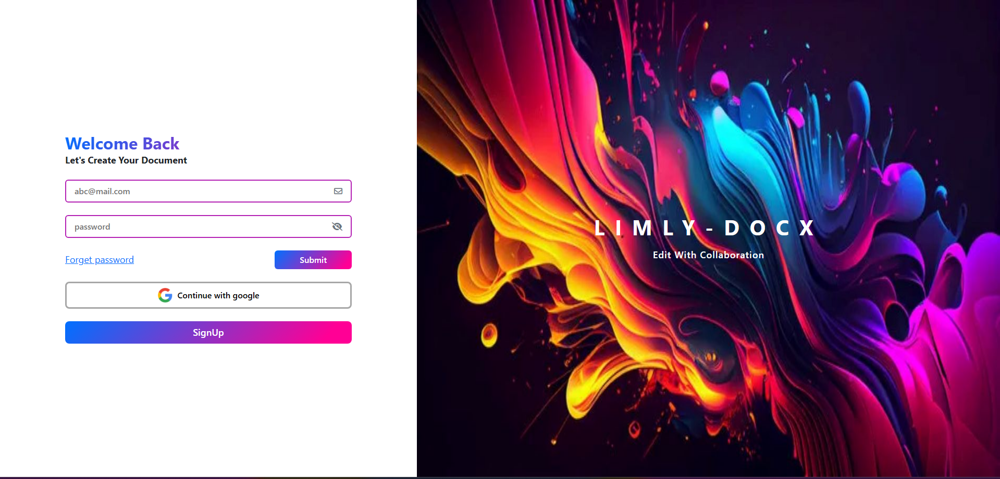

# LimlyDocx - A Collaborative Text-Editor

A Collaborative cloud text editor where you can create and customize documents in any format. LimlyDocx features a rich text editor and provides a secure environment for your work.

## Features

- Create your document or article with our Rich Text Editor.
- Invite your friends to collaborate and help you create your document.
- Invite your naughty friend to review the document, but restrict editing permissions to prevent unwanted changes.
- Upload your existing document files (e.g., `.pdf`, `.docx`, etc.) into the editor for easy editing.
- Export your document in various formats, including `.pdf` or `.docx` (Microsoft Word).
- Custom Dashboard to manage your documents and collaboration efforts.
- **Text-To-Speech (TTS)**: Tired of reading your professor’s long, boring explanations? With Limly, you can have any document or specific line read aloud, making learning more convenient and effortless.

## Tech Stack

- **Frontend**: HTML, CSS, Bootstrap, JavaScript, jQuery, Thymeleaf(SSR) 🖥️🎨
- **Backend**: Java, Spring Boot, Spring Security, OAuth2, WebSocket ⚙️🔒
- **Database**: MySQL 💾
- **Libraries**: QuillJs, itext (`.pdf`),  📚

## Coming Soon

- 🤖 **AI Bot**: An intelligent assistant that will help you write and review your documents, making content creation even easier and faster!

## LimlyDocx Gallery

**All Rights Reserved:**
- **Shamroz Khan is the owner of this repository**
- **Designed and Developed by Shamroz Khan**
